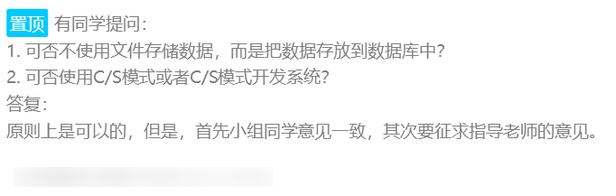

# Bank System GUI

一个沙比996了一个星期搞出来的自己很满意但是老师认为很超前的项目.....

其实吧他给了一个命题作文，但是脱离了应试教育的我想把这个东西做好。

老师在开会的时候说，这个项目要能够体现出你的水平，能够拿出去找工作，能够让人家看出你自己的独立的思考，自己的想法，加上你自己独特的见解。

最开始也没有那么多条条框框，不允许用Spring而已。

开始我们甚至想过，试试使用[Electron](https://github.com/electron/electron)去做前端渲染和展示，这样的话我们可以减少工作量，我们已经经历了一次Web前端实训，一次没有一次正课，但是“巩固大一前端知识”的虚空实训课，也是一个星期996，从0开始打基础。

所以，我们也是从0开始技术选型，从0开始速成JavaFX，从无到有实现.......

结果现在说太超前了，全部重做... 觉得控制台是最好的.... 但是你之前开会不是说，尽量不要用控制台？

之前累的时候，刷到了人家的课程设计，挺强的....大一自学编译原理，高级语言程序设计的课设自己实现了python，实现了语法解析......

南华大学，自学Qt写出了一个原神祈愿界面.....我那个时候...其实也在看Qt....但是考试周...

我看能不能找到我的C项目 最近也一起开源

我们甚至在研究，如何实现依赖注入，自己实现Bean管理（寒假读了Spring源码想到模仿他们的一个基于注解的Bean管理和依赖注入....最后没做了），翻烂了StackOverFlow 看了外网大佬的思路学人家实现了JavaFX的窗口管理，翻烂了JavaFX API 搞清楚了Stage的基本的生命周期.....（一星期也没看多少）

拿着之前当乙方的经验做了一点创新，结果是炫技.......

开源这个 至少感觉我自己有点价值....不至于对不起自己...

---

写一个冠冕堂皇的Readme...纪念我的996.....

---

数据库的连接我没有删除，给各位玩一下。

